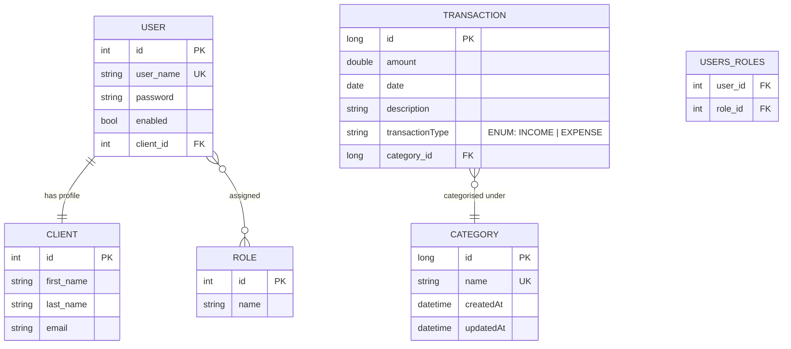
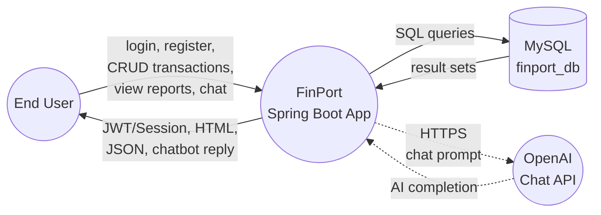
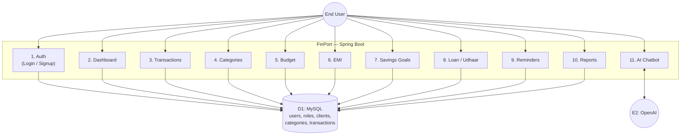
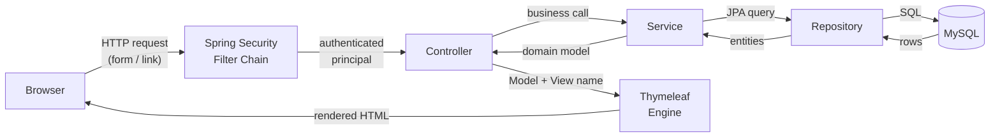

<div align="center">
  <h1>📈 FinPort: Personal Financial Portfolio Manager 📈</h1>
<h3>
  ✨ <a href="http://13.201.204.129:8080/index">Live Project</a>
</h3>
</div>

<!-- Table of Contents -->

# 📓 Table of Contents

* [About the Project](#star2-about-the-project)
  * [Screenshots](#camera-screenshots)
  * [Tech Stack](#space_invader-tech-stack)
  * [Project Structure](#file_folder-project-structure)
  * [Architecture](#building_construction-architecture)
    * [Entity-Relationship Diagram](#er_entity-entity-relationship-diagram)
    * [Data Flow Diagram](#data-flow-diagram)
  * [Features](#dart-features)
  * [Environment Variables](#key-environment-variables)
* [Getting Started](#toolbox-getting-started)
  * [Prerequisites](#bangbang-prerequisites)
  * [Installation](#gear-installation)
* [Deployment](#triangular_flag_on_post-deployment)
* [Usage](#eyes-usage)
* [Roadmap](#rocket-roadmap)
* [Contributing](#wave-contributing)
* [License](#warning-license)
* [Contact](#handshake-contact)

## ⭐ About the Project

FinPort is a comprehensive and intelligent personal financial portfolio manager web application built using Spring Boot and Thymeleaf. It allows users to manage their income, expenses, savings, EMIs, loans, taxes, and more—all in one place. It simplifies finance tracking with powerful visual insights and reminders.

### 📷 Screenshots

<div align="center">
  <table>
    <tr>
      <td></td>
      <td></td>
    </tr>
    <tr>
      <td></td>
      <td></td>
    </tr>
    <tr>
      <td></td>
      <td></td>
    </tr>
  </table>
</div>

  
  
</div>


### 👾 Tech Stack

<details>
  <summary>Backend</summary>
  <ul>
    <li>Java 17</li>
    <li>Spring Boot 3.3.5</li>
    <li>Spring Data JPA (Hibernate)</li>
    <li>Spring Security 6 (form login, BCrypt, role-based access)</li>
    <li>Bean Validation (Jakarta Validation)</li>
  </ul>
</details>

<details>
  <summary>Frontend</summary>
  <ul>
    <li>HTML5, CSS3, JavaScript</li>
    <li>Thymeleaf 3 + thymeleaf-extras-springsecurity6</li>
    <li>Chart.js (area / bar / pie dashboards)</li>
    <li>DataTables for tabular views</li>
  </ul>
</details>

<details>
  <summary>Database</summary>
  <ul>
    <li>MySQL 8 (driver: <code>com.mysql.cj.jdbc.Driver</code>)</li>
  </ul>
</details>

<details>
  <summary>Integrations</summary>
  <ul>
    <li>OpenAI Chat Completions API via <a href="https://github.com/TheoKanning/openai-java">openai-gpt3-java</a> (financial chatbot)</li>
  </ul>
</details>

<details>
  <summary>Deployment</summary>
  <ul>
    <li>AWS EC2 (Ubuntu) — packaged as a runnable jar</li>
  </ul>
</details>

### 🗂️ Project Structure

```text
FinPort/
├── pom.xml
└── src/
    ├── main/
    │   ├── java/com/expensetracker/expensetracker/
    │   │   ├── ExpensetrackerApplication.java        # Spring Boot entry point
    │   │   ├── configuration/
    │   │   │   ├── SecurityConfig.java               # Spring Security setup
    │   │   │   └── OpenAIConfig.java                 # OpenAI RestTemplate bean
    │   │   ├── controllers/
    │   │   │   ├── LoginController.java
    │   │   │   ├── SignupController.java
    │   │   │   ├── DashboardController.java
    │   │   │   ├── TransactionsController.java
    │   │   │   ├── CategoryController.java
    │   │   │   ├── ChatBotController.java
    │   │   │   └── CustomeAuthenticationSuccessHandler.java
    │   │   ├── models/                               # JPA entities
    │   │   │   ├── User.java, Role.java
    │   │   │   ├── Category.java, Transaction.java
    │   │   │   └── Client.java
    │   │   ├── repository/                           # Spring Data repositories
    │   │   │   ├── UserRepository.java
    │   │   │   ├── RoleRepository.java
    │   │   │   └── ClientRepository.java
    │   │   ├── services/                             # Service layer + repo beans
    │   │   │   ├── UserService(Impl).java
    │   │   │   ├── ClientService(Impl).java
    │   │   │   ├── RoleService(Impl).java
    │   │   │   ├── CategoryService.java / CategoryRepository.java
    │   │   │   └── TransactionService.java / TransactionRepository.java
    │   │   └── DTO/
    │   │       ├── WebUser.java                      # Registration form binding
    │   │       └── CustomUserDetails.java            # Spring Security user
    │   └── resources/
    │       ├── application.properties                # MySQL + OpenAI config
    │       ├── static/{css,js,assets}                # Static assets & demos
    │       └── templates/                            # Thymeleaf views
    │           ├── layouts/master.html               # Common layout
    │           ├── fragments/{navbar,chatbot}.html
    │           ├── landing-page.html
    │           ├── login-page.html / registration-page.html
    │           ├── index.html                        # Authenticated dashboard
    │           ├── transactions.html / add-transaction.html / edit-transaction.html
    │           ├── categories.html / create-new-category.html / edit-category.html
    │           ├── budget-management.html
    │           ├── emi-management.html
    │           ├── loan-udhaar.html
    │           ├── savings-goals.html
    │           ├── reminders.html
    │           └── reports.html
    └── test/
        └── ExpensetrackerApplicationTests.java
```

## 🏗️ Architecture

### 🧩 Entity-Relationship Diagram

The application uses 5 JPA entities. `User` is the aggregate root, owns a `Client` profile, has one or more `Role`s, and logs `Transaction`s that are grouped by `Category`.



**Cardinality summary**

| Relationship | Type | Join column |
|---|---|---|
| `User` ↔ `Client` | 1 : 1 | `users.client_id` |
| `User` ↔ `Role` | M : N | `users_roles(user_id, role_id)` |
| `Transaction` → `Category` | M : 1 | `transactions.category_id` |

### 🔁 Data Flow Diagram

**Level 0 — Context Diagram**
Shows the system as a single process and its external entities.



**Level 1 — Internal Modules**
Decomposes the FinPort process into its main sub-processes (one per controller/service group).



**Request lifecycle (Spring MVC)**



### 🎯 Features

* ✉️ **User Registration / Login** — Spring Security with BCrypt, custom success handler, role-based redirects.
* 🏠 **Dashboard** — Aggregated financial overview with area, bar and pie charts.
* 💼 **Income & Expense Tracking** — CRUD transactions, edit/delete with category association.
* 🏷️ **Category Management** — Create, edit and organize custom categories.
* 📊 **Budget Management** — Set and monitor budgets against spending.
* 💳 **EMI Tracking** — Manage equated monthly installments and outstanding balances.
* 💵 **Loan & Udhaar Management** — Track money lent / borrowed.
* 🎁 **Savings Goals** — Define goals and track progress.
* 📆 **Reminders** — Bills and payment reminders.
* 📈 **Reports** — Visual financial summaries.
* 🤖 **AI Chatbot** — OpenAI-powered financial Q&A (set `openai.api.key` in `application.properties`).

### 🔑 Environment Variables

All sensitive values are read from environment variables — **never commit secrets to the repo**.

| Variable | Default | Description |
|---|---|---|
| `DB_URL` | `jdbc:mysql://localhost:3306/finport_db` | MySQL JDBC URL |
| `DB_USERNAME` | `root` | MySQL username |
| `DB_PASSWORD` | *(empty)* | MySQL password — **required** |
| `OPENAI_API_KEY` | *(empty)* | OpenAI API key — required only for the chatbot |

Set them in your shell before running:

```bash
export DB_URL=jdbc:mysql://localhost:3306/finport_db
export DB_USERNAME=root
export DB_PASSWORD=your_password
export OPENAI_API_KEY=sk-...
./mvnw spring-boot:run
```

For local development you can also create `FinPort/src/main/resources/application-local.properties` (already in `.gitignore`) and override values there.

```properties
# application-local.properties  (NOT committed)
spring.datasource.password=your_local_password
openai.api.key=your_local_openai_key
```

> ⚠️ The chatbot is optional — if `OPENAI_API_KEY` is empty, the rest of the app continues to work; only the chatbot endpoint will fail.

## 🛠️ Getting Started

### ‼️ Prerequisites

* Java 17+
* Maven
* MySQL

### ⚙️ Installation

```bash
# 1. Clone the repo
git clone https://github.com/abhi03241/FinPort.git
cd FinPort

# 2. Create the database in MySQL
mysql -u root -p -e "CREATE DATABASE finport_db;"

# 3. Set environment variables (DB_PASSWORD, OPENAI_API_KEY, …)
#    See "Environment Variables" below.

# 4. Run with Maven (uses the included mvnw wrapper)
./mvnw spring-boot:run
```

Visit: `http://localhost:8080/index`

## 📍 Deployment

The application is deployed on an **AWS EC2** instance.

```bash
# For running in background
nohup java -jar target/FinPort-0.0.1-SNAPSHOT.jar &
```

Access Live at: [http://13.201.204.129:8080/index](http://13.201.204.129:8080/index)

## 👁️ Usage

1. Register a new account from `/register` or sign in at `/login`.
2. After login, you are redirected to `/index` — the main dashboard.
3. Use the top navigation to access:
   * **Transactions** — log income & expenses
   * **Categories** — organize your transactions
   * **Budget** — set spending limits
   * **EMI** — track installments
   * **Loan / Udhaar** — manage money lent or borrowed
   * **Savings Goals** — set and track goals
   * **Reminders** — schedule bill & payment alerts
   * **Reports** — visual summaries
   * **Chatbot** — ask financial questions (requires `openai.api.key`)

## 🛣️ Roadmap

* [ ] Email / SMS notifications for reminders
* [ ] Multi-currency support
* [ ] Recurring transactions
* [ ] Mobile-responsive UI improvements
* [ ] Export reports as PDF / Excel
* [ ] Plaid / bank-account integration

## 👋 Contributing

We welcome contributions! Create a pull request or raise issues.

## ⚠️ License

This project is licensed under the MIT License.

## 🤝 Contact

**Abhishek Shukla**

GitHub: [https://github.com/abhi03241](https://github.com/abhi03241)
